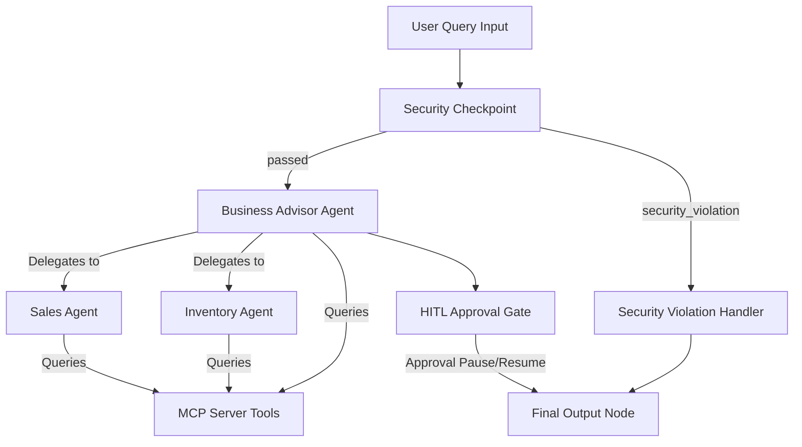

# Submission Write-Up: BizGuardian AI

## Problem Statement

Micro, Small, and Medium Enterprises (MSMEs) make up the backbone of global economies, yet they suffer from a lack of integrated business intelligence tools. Small business owners typically manage operations across fragmented sources—spreadsheet sales files, paper logs, or siloed inventory databases. Without dedicated financial and logistics experts, they struggle to:
1.  Forecast customer demand and identify sales opportunities.
2.  Predict inventory shortages before they disrupt supply chains.
3.  Synthesize overall finances into a single, cohesive cash flow health indicator.

**BizGuardian AI** solves this by offering an automated, secure business concierge. Business owners upload raw operations tables (CSV/Excel) and chat with a specialized agent team that extracts insights from the databases securely and coordinates action plans.

---

## Solution Architecture

The agent architecture uses a **Google ADK 2.0 Graph Workflow** to control flow, enforce guardrails, and manage human approvals.

---

## Concepts Used

*   **ADK 2.0 Workflow**: Implemented in [agent.py](file:///Users/tejasri/Desktop/build%20with%20ai%20/bizguardian-ai/app/agent.py#L198-L215), controlling flow from security scrubbers to specialized agents and approval gates.
*   **LlmAgent & AgentTool**: The orchestrator (`business_advisor`) delegates to specialized sub-agents (`sales_agent`, `inventory_agent`) using `AgentTool` in [agent.py](file:///Users/tejasri/Desktop/build%20with%20ai%20/bizguardian-ai/app/agent.py#L90-L95).
*   **MCP Server**: Implemented in [mcp_server.py](file:///Users/tejasri/Desktop/build%20with%20ai%20/bizguardian-ai/app/mcp_server.py), implementing tool declarations that query SQLite tables safely.
*   **Security Checkpoint**: Implemented in [agent.py](file:///Users/tejasri/Desktop/build%20with%20ai%20/bizguardian-ai/app/agent.py#L104-L127) as a graph node which scrubs PII and checks for prompt injections.
*   **Agents CLI**: Scaffolded, packaged, and verified locally using `agents-cli`.

---

## Security Design

1.  **PII Scrubbing**: Regex filters automatically scan all input text for email addresses and phone numbers. If matched, the sensitive strings are replaced with redaction tags before the text reaches LLM models.
2.  **Prompt Injection Check**: A list of common adversarial overrides (e.g. "ignore previous instructions") is checked. If matched, execution is routed directly to a block handler.
3.  **Audit Logs**: All security actions (PII redactions, injection attempts, and human approvals) are recorded in the local SQLite `audit_logs` table with timestamp and severity levels.

---

## MCP Server Design

The Model Context Protocol (MCP) server runs as a subprocess communicating via stdio:
*   `query_sales_trends`: Pulls chronological sales records to detect performance spikes.
*   `query_inventory_status`: Pulls levels and flags items with safety stock risks.
*   `query_financial_summary`: Dynamically computes total revenue, expenses, and current cash balances.

---

## Human-in-the-Loop (HITL) Flow

To prevent costly errors, the workflow is gated. If the advisor agent recommends placing a reorder exceeding 50 units or costing more than $1000:
1.  The workflow yields a `RequestInput` payload.
2.  The FastAPI backend intercepts this and returns a `paused` state to the React frontend.
3.  The frontend prompts the user with green/red buttons to Approve or Reject the purchase.
4.  Once the user clicks, a `FunctionResponse` is dispatched, resuming the runner.

---

## Demo Walkthrough

1.  **Upload Datasets**: Business owner uploads `sales.csv` and `inventory.csv` in the Upload Center. The SQLite database is seeded.
2.  **Ask for Health Check**: User types "Check my business health." The query is checked, passed to the advisor, and a detailed markdown health scorecard is returned.
3.  **Approve Purchase Plan**: User types "I want to reorder stock." The agent checks inventory, identifies a shortage, drafts a reorder of 100 units, and prompts for approval. The user approves, and the database audit logs log the choice.

---

## Impact / Value Statement

BizGuardian AI bridges the technology gap for MSMEs. By deploying advanced LLM orchestration, structured workflow safety, and local database groundings via MCP, it gives small business owners the advisory capability of a professional command dashboard without high consulting overheads.
